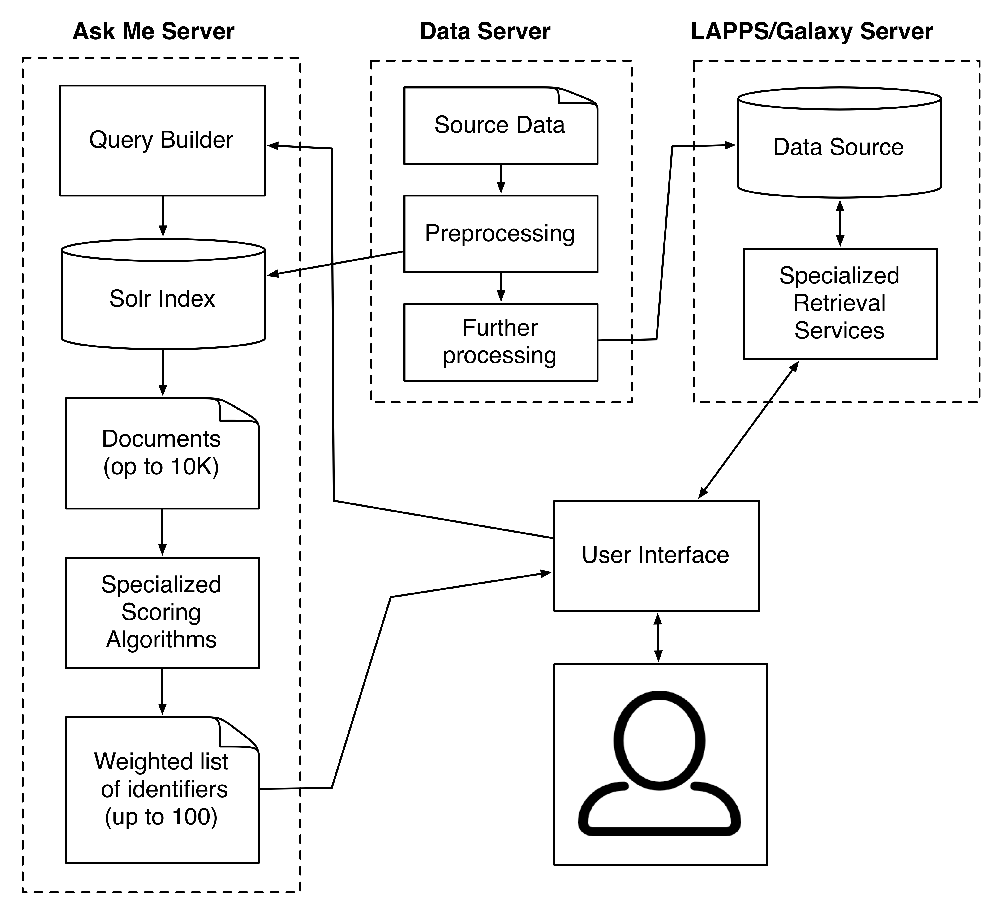

# EAGER Design Notes

Last updated: November 30th 2018

**NOTE** This is a work in progress and is likely already out of date...

### Current workflow

Current workflow for the site at https://services.lappsgrid.org/eager/ask is:

- Query generation. Take the user input and generate a Solr query.
- Execute the Solr query. Solr returns up to 10K documents.
- For each document
    - Apply algorithm to each section (title, abstract, introduction, etc)
    - Weight each section/algorithm
    - Normalize scores
- Return sorted list of documents (document IDs). Limited to top 100.

### Proposed full workflow

The proposed workflow for the entire EAGER application is:

The part on the left is very much the same as the current workflow:

- The user sends of a query through the user interface, which currently lives on the Ask Me Server.
- The Ask Me Server builds a Solr query, executes it to return up to 10K documents and then runs a couple of specialized scoring algorithms on these.
- It then returns up to 100 identifiers (this limit is not implemented or not used yet)

Now, instead of using these identifiers to present answers to the user (which is what happens now), the identifiers can be sent to specialized retrieval services on a LAPPS/Galaxy instance. Retrieval may not be the best name since processing is limited to the documents that go with the identifiers, what happens could be thought of as further processing, ranking and structuring of the previous retrieval results. The steps involved are:

- Retrieve the documents using the input identifiers.
- Collect the extra information that is available here and not in the Solr index (named entities, dependency parse, etcetera), and potentially perform some more light processing.
- Use the extra information to further filter and/or structure the answer set.
- Return the answer set to the user.

# Web Application

The `web` modules contains a Spring Boot web application that provides a Web front and a REST API.  The web application is written in Groovy and also uses Groovy templates to generate the HTML UI.  The HTML UI uses [Less](http://lesscss.org) for CSS styling with some [JQuery](https://jquery.com) and JavaScript.

# Query Processing

The query processing module takes a single sentence (the question) and transforms it into a query for the search engine being used.  Currently only Solr is supported.

### Data creation

The Ask Me Server and the LAPPS/Galaxy server have access to the same documents. These documents are preprocessed off line and then index by Solr on one end and entered as LIF files into a data source on the other end. Typically, the data embedded in the LAPPS data sources will be richer.
