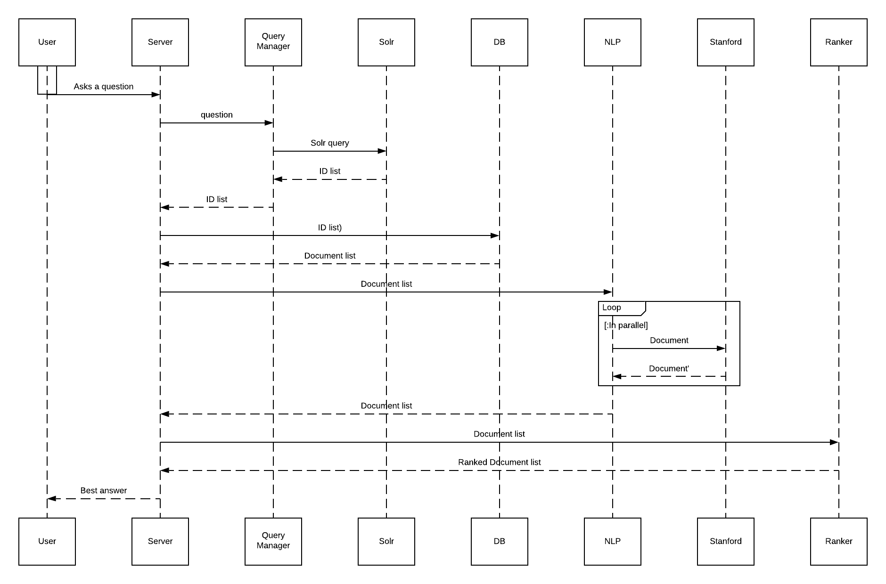

# Scaling The Application

There are two ways to scale an application:

- **Vertically** Make the machines faster by adding more (or faster) CPUs, or adding more memory.  More CPUs will allow the server to complete the same amount of work in less time and more memory means more application data can be help in memory reducing cache misses and disk I/O.
- **Horizontally**  Vertical scaling can only go so far; every server has a limit on the CPUs and memory it can hold.  Once a server has been expanded to its maximum capacity the only remaining option is to add more machines.

In the sequence diagram above every solid outgoing arrow from the *Server* and dotted line back to *Server* (e.g. sending a list of IDs to the *DB* and receiving a list of documents in return) denotes an operation, or series of operations the is a good candidate for parallelization.  From the sequence diagram we can identify four main modules:

1. Query processing
1. Document retreival
1. NLP processing
1. Document ranking.

To some extent the existing design already performs some horizontal scaling as Solr and the document database already run on separate machines.  If the Solr queries are too slow then more Solr nodes can be added to the [Solr Swarm](infrastructure.md#solr-cloud).  However, even though Solr and the document database run on separate machines the processing in still performed in a linear sequence, that is, all the steps in the sequence diagram must be performed for a given question before processing the next question can begin. By constructing a pipeline of the four tasks that can be run in parallel we can theoretically be working on four questions at once.

## Messaging

Talking points:

1. The `org.lappsgrid.eager.rabbitmq` package provides a facade for [RabbitMQ]() that handles creating connections, channels, etc.

## Next Steps

1. Run each of the four tasks (query processing, document retreival, NLP, and document ranking) in their own threads.
1. Have the four tasks communicate via RabbitMQ mailboxes.
1. Break each task into its own stand-alone service.

Depending on the server the task services can be run on a single machine or spread across multiple machines. The most likely deployment scenario is to package each task in a Docker image and then run container on a Docker swarm.  This allows horizontal scaling by launching more containers for a given task.

