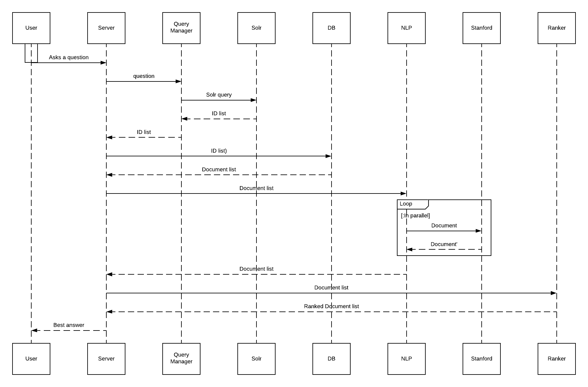
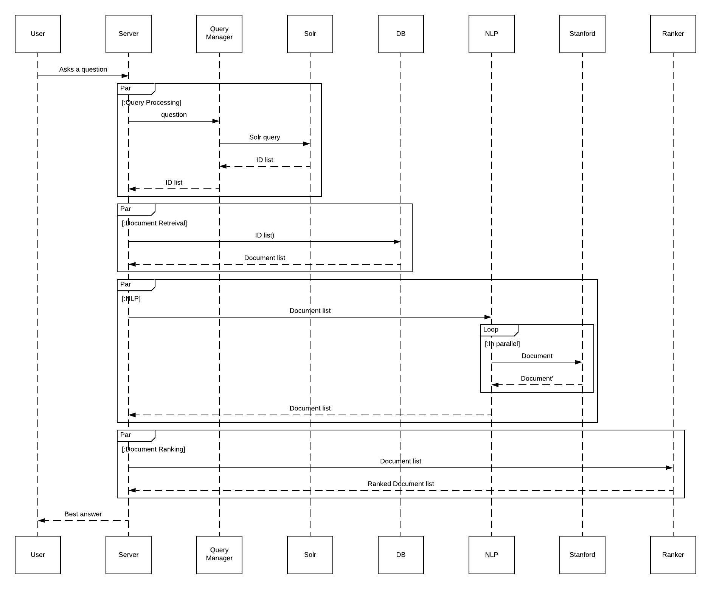
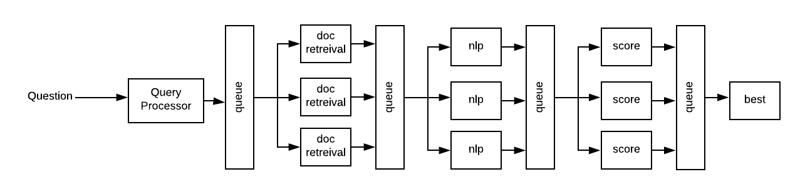

# Scaling The Application

There are two ways to scale an application:

- **Vertically**<br/>Make the machines faster by adding more (or faster) CPUs and/or adding more memory.  Adding more CPUs will allow the server to complete the same amount of work in less time. More memory means more application data can be held in memory reducing cache misses and disk I/O.
- **Horizontally**<br/>Vertical scaling can only go so far.  Once a server has been expanded to its maximum capacity the only remaining option is to add more machines.



In the sequence diagram above every solid outgoing arrow from the *Server* and dotted line back to *Server* (e.g. sending a list of IDs to the *DB* and receiving a list of documents in return) denotes an operation, or series of operations that is a good candidate for parallelization.  From the sequence diagram we can identify four main modules:

1. Query processing
1. Document retreival
1. NLP processing
1. Document ranking.



To some extent the existing design already performs some horizontal scaling as Solr and the document database already run on separate machines.  If the Solr queries are too slow then more Solr nodes can be added to the [Solr Cloud](infrastructure.md#solr-cloud).  However, even though Solr and the document database run on separate machines all processing in still performed in a linear sequence, that is, all the steps in the sequence diagram must be performed for a given question before processing the next question can begin. By constructing a pipeline of the four tasks that can be run in parallel we can theoretically be working on four questions at once.

## Messaging

To be able to scale the separate parts of the application independently of one another a [message passing system](https://en.wikipedia.org/wiki/Message_passing) is used to decouple the modules.  A sequential implementation of the AskMe pipeline might look like (in psuedo code):

``` 
String pipeline(String question) {
    List idList = solr(question)
    List docments = retrieve(idList)
    documents = nlp(documents)
    documents = rank(document)
    return best_answer(documents)
}
```
or
``` 
String pipeline(String question) {
    return best_answer(rank(nlp(retrieve(solr(question)))))
}
```
To be able to scale each stage of the pipeline independently the stage must be able to run its own thread.  Once a pipeline stage is running in its own thread simple function calls like the above are no longer a viable implementation strategy. For example, in the above psuedo-code the `best_answer` method can not start until `rank` returns, `rank` can not start until `retrieve` returns. To fully utilize multiple threads there should be a queue data structure between each stage so worker threads can read data from an input queue and write data to an output queue.



Message brokers such as [RabbitMQ](https://rabbitmq), [ActiveMQ](http://activemq.apache.org), or [ZeroMQ](http://zeromq.org) all provide frameworks to handle the queues and message passing from workers to queues. There is an example processing pipeline based on message passing in the [rabbitmq module](../rabbitmq/src/test/groovy/org/lappsgrid/eager/rabbitmq/example/README.md).

## Next Steps

1. Run each of the four tasks (query processing, document retreival, NLP, and document ranking) in their own threads.
1. Have the four tasks communicate via RabbitMQ mailboxes.
1. Break each task into its own stand-alone service.

Depending on the server the task services can be run on a single machine or spread across multiple machines. The most likely deployment scenario is to package each task in a Docker image and then run the containers on a Docker swarm.  This allows horizontal scaling by launching more containers for a given task.


