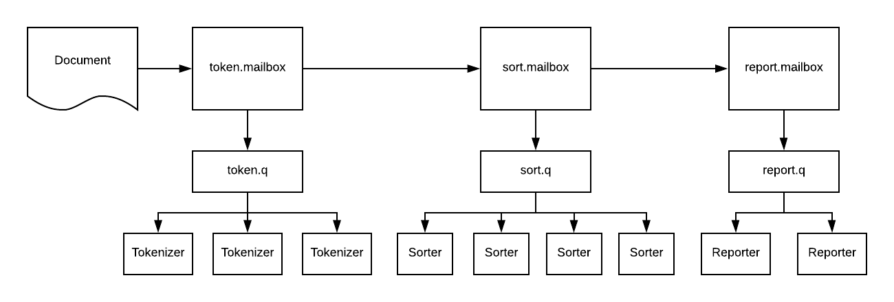

# Distributed Task Example

This example presents a simple processing pipeline with a different number of workers for each task.  The pipeline starts with an input string and:

1. Tokenizes the string (3 workers)
1. Sorts the tokens (4 workers)
1. Writes the result to System.out (2 workers)

Each stage of the pipeline is managed by a `QueueManager` that maintains a `TaskQueue` and a pool of workers. Each worker is dealt tasks from its `TaskQueue`



The worker classes `Tokenizer` and `Sorter` forward the data they have worked on to the next stage in the pipeline with the `PostOffice.send(Message)` API.  Note that the workers do not need to know where they are sending the data as the Message route was set before the message was submitted to the pipeline.

```java
@Override
public class MyWorker extends Worker { 
    PostOffice po;		
		
    public void work(String json) {
        Message message = Serializer.parse(json, Message.class);
        Object body = do_the_work(message.getBody());
        message.setBody(body);
        po.send(message);	
    }
}
```

**Note** In this example an instance of `CountDownLatch` is passed directly to the `Reporter` class so it can perform a `latch.countDown()` when it has completed its work.  However, if the `Reporter` instances were to be run in another process, or on another machine, then another means of synchronization would be needed.

